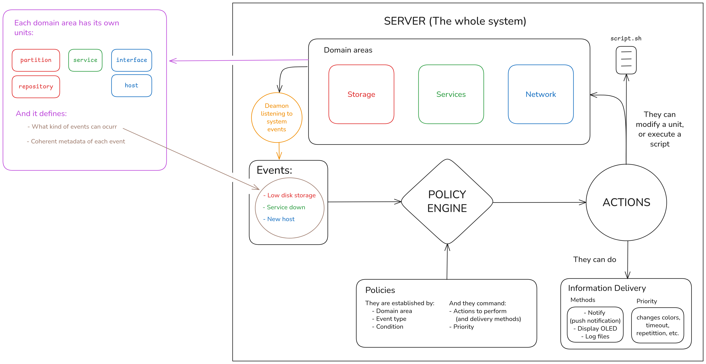

# Landserm Concept

## What is LandSerM?
This acronim stands for **Local Area Network and Server Monitor**. That is the idea, thay you can easily configure/personalize triggers on events, custom logs, display storage and services monitoring, network changes and weird traffic, etc.

## How does it work?
You must configure some rules (policies) so the daemon can now what to do. Let's say you only enabled the daemon to monitor the domain area of services. Then **the daemon starts to listen the events from the services you selected**. When there's a new event, it goes through the policy engine, the one that stablishes what to do with it.

The **policy engine** just follows instructions. It depends on the *domain area*, *event kind* and a *detailed condition*: For example, if the **service was stopped without your intervention**; in case of storage domain it could be the `name` or the `mountpoint` of your partition or repository. If these 3 things are fulfilled, then it performs the actions you specified in the policy.

The **actions** that you could choose are: To modify a unit (for example, delete old files, restart service, block ip address), to execute any script, and to deliver the event information by push notification in your phone through notifiy, a discord webhook, an OLED display, clean file logs, etc.

> [!NOTE]
> You can choose multiple actions to perform, it isn't limited by one.

## How should I configure it?

You have to edit it with the landserm *Command Line Interface* `landserm config <configType> <show|list|edit> <args>`

`configType` = `domains|policies|delivery`

* For policies you can also want to do `landserm config policies add` to make a new policy.
* For a config type different to delivery (it means domains or policies) you can or you have to (depends on the case) specify domain with `--domain <domain>`.
* For any config type, you should edit like this `landserm config <configType> edit --domain <domain> <dot.notation.path>`, use domain only when needed (don't worry, the CLI will make you now). You must use show command to see what you are doing better, specially with dot notation path wich hasn't got autocompletion yet.

## What if I configure something wrong?

It won't likely happen because I'm using pydantic validation. Anyway, you can write an issue and I'll help you. Just make sure you use the CLI and do NOT edit any `.yaml` file.

## Delivery
You can configure delivery methods with `landserm config delivery edit` (use `landserm config delivery show` first). For WEBHOOK_URL and GOTIFY_APP_TOKEN you'll need to modify `/etc/landserm/.env` file and assign the values to the variables yourself.

`pushMethods` = `ntfy|gotify|webhook`

### Delivery Config:
Follow the template (with config delivery show) and use commands without arguments to get help. All methods can be enabled or disabled globally for all policies.
* Push: configure server, token, url, etc.
* Logs: configure folder path. The default is `/var/log/landserm/`, I suggest you to use that one.
* Oled: change default values if your display is different. You'll probably need to change `address`, `device` and more.

### Policies:
* Push: you can specify wich push methods to use in your policy, inside `then` block, adding one or more *pushMethods* to the list with `landserm config policies edit --domain <domain> <policy-name>.then.push `
* Logs: you can enable it editing enable property as I already explained it.
* Oled: you can specify a message and duration in seconds. Use edit command.

## Policies

They can configure scripts to execute and arguments based on context variables (for example, `$subject` and `$systemdInfo.<property>` from the event). Each policy has a priority in its action block (the `then` block).

`subject`: service name without `.service`
`priority` = `low|default|high|urgent`

# Real Landserm Version 1.0

This version has only got one domain: `services`. The code is intended to standardize "domains" for the next version. 

Right now, the only hability of this project is to monitorize d-bus messages looking for systemdInfo of the specified services you configure with `landserm config domains --domain services edit include` and then `landserm config domains --domain services enable`. You can configure policies as mentioned earlier, the only thing is that this is very generic and doesn't have a lot of info. The only "detailed" conditions you'll have are systemdInfo properties:

| Property | Description |
|----------|-------------|
| `active` | Current active state of the service |
| `substate` | More detailed state information |
| `load` | Whether the unit file was loaded successfully |
| `result` | Result of the last execution |
| `exec_main` | Process ID of the main service process |

# Setup

1. Clone this repository in opt with `cd /opt && sudo git clone https://github.com/GonzaStd/landserm && cd landserm`

2. Execute installation script with `sudo bash setup/install.sh` and wait until it is finished. Note that if you don't enable landserm-daemon in the installation, you'll have to enable it with `sudo systemctl enable landserm && sudo systemctl start landserm`. You can see daemon logs looking for any trouble with `sudo cat /var/log/landserm/landserm-daemon.log`.

If you want to uninstall this tool (landserm-daemon and landserm CLI) use `sudo bash setup/uninstall.sh` inside of `/opt/landserm`.